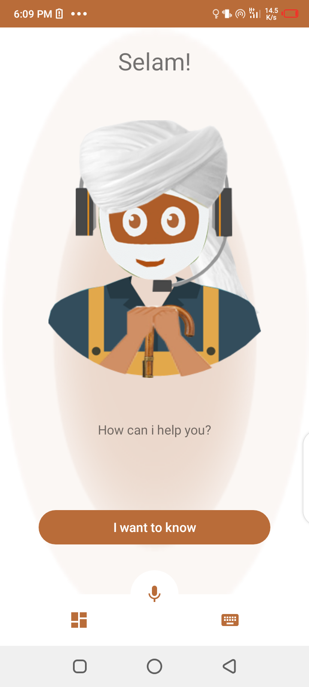
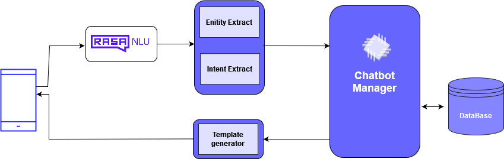

# 🤖 + 👨‍🌾 ChatBot for Agriculture ― Webstack Portfolio Project




## Description of the project
This project intended to build a clone of an industrial closed-domain and task-oriented chatbot system which respond to sufficient nutrientation level of different crops

### General concepts in review
As you navigate this code base, it is great to note the following concepts, while completing this project.
- How to create a Python package
- How to create a command interpreter in Python using the cmd module
- What is Unit testing and how to implement it in a large project
- How to serialize and deserialize a Class
- How to write and read a JSON file
- How to manage datetime
- What is an UUID
- What is *args and how to use it
- What is **kwargs and how to use it
- How to handle named arguments in a function

## Program workflow



## Files and Directories
- ```bot_manager.py``` start the entire apllication the entire project. 
.

